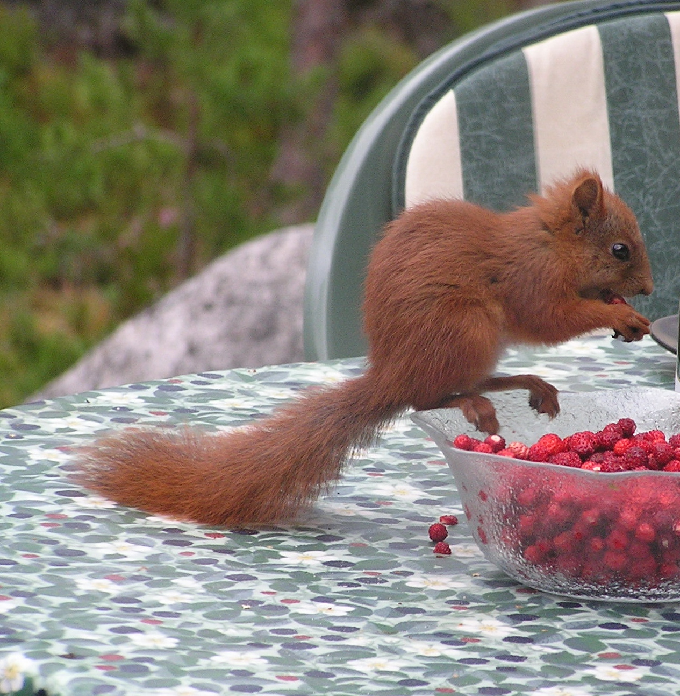
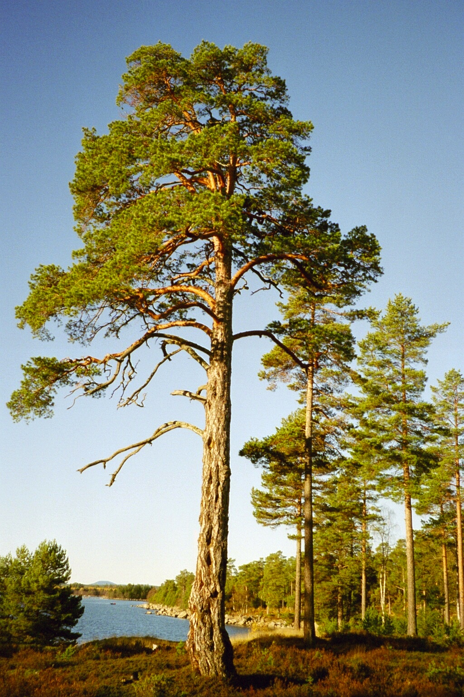

# IT, matematik och Chalmers från insidan

## IT, matematik och Chalmers från insidan

* Patrik Jansson, lärare och forskare i datavetenskap på Chalmers

. . .

* Lite om forskning

. . .

* Lite om Chalmers och GU

. . .

* Mycket om datavetenskap och Databävern

## Forskning: Nyfikenhet och ny kunskap

* Hur fungerar världen?
* Hur kan vi förklara den bättre?
* Hur hjälper vi till att skapa en hållbar framtid?

## Utbildning: Klättra högt så får du bra utsikt!

* Kronan: Högskolor och universitet (3-5 år): Chalmers och Göteborgs universitet (GU)
* Låga grenar: Gymnasieskola (3 år)
* Stammen: Grundskola (9 år för alla)

## Vad är datavetenskap?

* logiskt tänkande
* problemlösning
* programmering

## Databävern: övning i datalogiskt tänkande

Kluringar på olika nivåer:

* Mini (klass 2-3)
* **Benjamin (klass 4-5)**
* Cadet (klass 6-7)
* Junior (klass 8-9)
* Senior (Gymnasiet)

. . .

http://bebras.se/

* Övninguppgifter med lösningar finns på nätet
* Man kan öva hur mycket man vill.
* Det finns också en **tävling** varje år i november

## Databävern: Uppgifter från Benjamin "år 3014" {.allowframebreaks}

* Hur mycket kan Mauri tjäna?
* Hur många sedlar
* Plattsättning i badrummet
* Bävrarnas påklädningsregler
* Vatten till kon
* Uppför trapporna
* Kvadrat
* Städer
* Svartvita bilder
* Labyrint
* Torn av klossar
* Längdordning
* Pappersvikning
* Den saknade biten

Länkar till uppgifterna:
[1](http://bebras.se/quiz/Benjamin/3014/1),
[2](http://bebras.se/quiz/Benjamin/3014/2),
[3](http://bebras.se/quiz/Benjamin/3014/3),
[4](http://bebras.se/quiz/Benjamin/3014/4),
[5](http://bebras.se/quiz/Benjamin/3014/5),
[6](http://bebras.se/quiz/Benjamin/3014/6),
[7](http://bebras.se/quiz/Benjamin/3014/7),
[8](http://bebras.se/quiz/Benjamin/3014/8),
[9](http://bebras.se/quiz/Benjamin/3014/9),
[10](http://bebras.se/quiz/Benjamin/3014/10),
[11](http://bebras.se/quiz/Benjamin/3014/11),
[12](http://bebras.se/quiz/Benjamin/3014/12),
[13](http://bebras.se/quiz/Benjamin/3014/13),
[14](http://bebras.se/quiz/Benjamin/3014/14)
